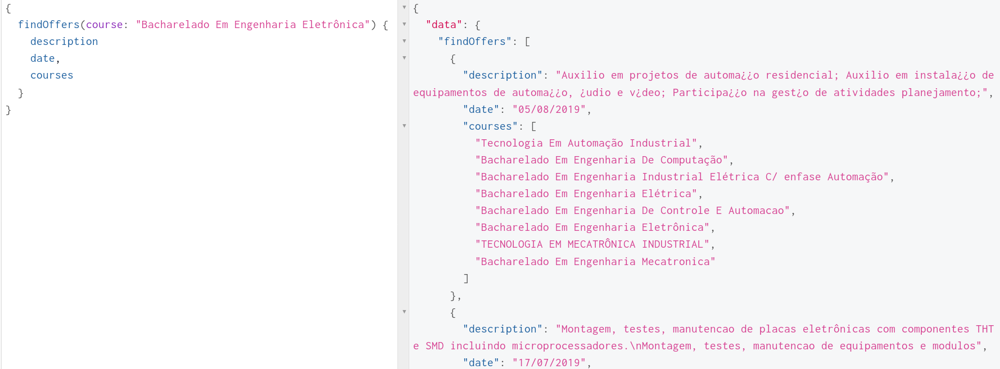

# graphql-estagios

GraphQL API for data mined with [puppeteer-estagio-fetcher](https://github.com/fsmiamoto/puppeteer-estagio-fetcher) of job offers found at the UTFPR website.

API avaliable for tests at:
https://estagios-fetcher-api.herokuapp.com/

You can use [GraphiQL Online](https://graphiql-online.com) to make queries to the address above.

### Avaliable fields:
```bash
type Offer {
    code: String # ID of the offer
    description: String
    jobType: String # Full Time job or internship
    date: String # Date of publication
    courses: [String] # Majors that have this offer avaliable
}
```

### Avaliable queries:
```bash
# Fetches all offers
getOffers: [Offer]!

# Find offers with the specified parameters, all optional
findOffers(code: String, description: String, jobType: String, date: String, course: String): [Offer]!
```



### Built with:
 - Node.js
 - Typescript
 - MongoDB
 - Apollo Server


